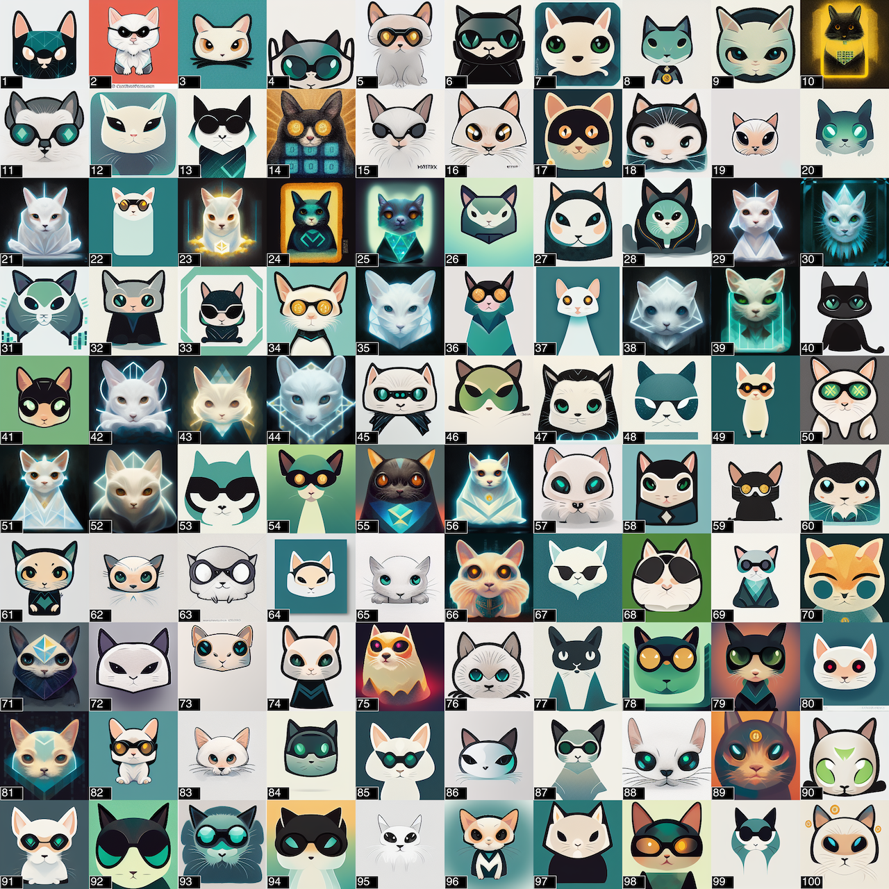

# Matrix Cat 

This is a fun NFT project for the Matrix team @CertiK. It has 100 AI-generated cat avatars:



## Usage

Create a .env file:

```
ALCHEMY_GOERLI_KEY=...
ALCHEMY_MAINNET_KEY=...
ACCOUNT_PRIVATE_KEY=...
ETHERSCAN_KEY=...
```

Then: 

```
nvm use 16.18.0
npm i
npx hardhat compile
npx hardhat test
npx hardhat run --network goerli scripts/deploy.ts
npx hardhat verify <contract-address> --network goerli
npx hardhat run --network mainnet scripts/deploy.ts
npx hardhat verify <contract-address> --network mainnet
```

